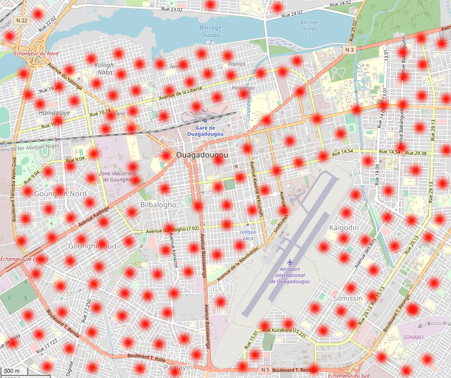

# Bootstrapping a new local currency

Each local currency needs
* a large set of possible geolocations for meetups on the area where the local currency is supposed to be minted.
* a trusted setup for its first ceremony
* lots of word-of-mouth to grow

## Defining the Currencies' Geographical Extension

Whoever bootstraps a new currency defines a large set of potential meetup locations which defines the minting area for the new currency

 

These locations are listed in a json file similar to this:

```json
{
  "meetup_locations": 
  [
    { "lat": 12.359741, "lon": -1.528151 },
    { "lat": 12.359012, "lon": -1.528896 }
  ]
}
```
Alternatively, the locations could be specified in [GEOjson (RFC7946) format MultiPoint](https://tools.ietf.org/html/rfc7946#section-3.1.3)


The list can be extended by on-chain governance later, but make sure the number of meetup locations is large to get a good randomization. A population of 1M should have in the order of 1M locations for meetups. The more the better.

This list is then compressed and commited to IPFS and the ipfs hash has to be sent to encointer-node together with the registration of the trusted setup below.

## Trusted Setup

An encointer local currency should only be trusted if it was bootstrapped with a public trusted setup ceremony. In the best case you find locally renowned people to participate in the first ceremony. For the trusted setup it is recommended that public keys used for the ceremony are made public by their owners.

1. Define set of meetup locations (see above)
2. select one of these locations for your trusted setup ceremony (this location will be called the *seed*)
3. gather the public keys of all participants (between 3 and 12. the more the better)
4. send a `new_seed()` extrinsic to encointer-node prior to the next ceremony including all the above information.
5. advertise the next ceremony to have as many spectators as possible.
6. on day X, hold the meetup
7. done

## Modify Locations

If at a later stage you'd like to enlargen set of meetup locations, there will be an on-chain governance ready for this. Most likely, this should be a one-person-one-vote ballot.

## Overlaps

Overlapping local currencies are perfectly fine. People can choose for which seed they would like to regsister with every ceremony. They can change their mind every month.


