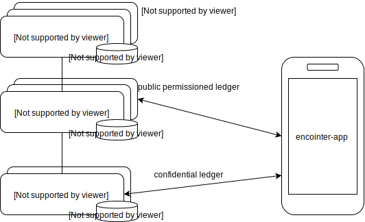

# Encointer "Cantillon" Testnet Specification

This document specifies a first testnet for encointer with the working title "Cantillon". 

## Key Differences with [Encointer Whitepaper](https://github.com/encointer/whitepaper)

  * no dPOET consensus. 
    * This testnet shall become a parachain to [Kusama](https://kusama.network/) based on [substrate](https://substrate.dev)
    * no decentralization. The Parachain will feature PoA consensus with Kusama as root-of-trust.
  * no proportional fees. Classical per-transaction base fees will be applied
  * confidential state updates will be implemented with [SubstraTEE](https://github.com/scs/substraTEE)
  * no private smart contracts yet
  * in addition to ceremonies happening every 41 days, there will be daily rehearsal ceremonies that allow to practise and demonstrate meetups
  
## Validators

The Cantillon testnet will be validated (centralized) by encointer.org

## Tokens

### NCTR
  * unit: 1 NCTR = 1 exa WINK (10^18). a wink is the smallest (atomic) unit of NCTR
  * initial supply: 0
  * supply cap: none
  * nominal inflation: every ceremony issues 1.0 NCTR per legit participant

Encointer tokens (NCTR) are different than global cryptocurrencies. NCTR are geo-located/local tokens. They can be transferred globally, but they carry an attribute we call "seed" of the region where the first meetup of a regions cluster took place. 
The Testnet will allow any group of at least three people anywhere in the world to bootstrap their own new seed. Subsequent meetups in the same region will carry that seed and define that region's local currency.

NCTR issuance and transfers are private. The ledger is managed off-chain by SubstraTEE workers.

NCTR tokens are issued as rewards to ceremony participants.

### ERT
  * unit: 1 ERT = 10^18 atto ERT (smalles atomic unit, no specific name)
  * initial supply: 1M ERT, owned by encointer.org
  * supply cap: 1M ERT
  * nominal inflation: none
  
The native token of the encointer blockchain is Encointer Registry Token (ERT). Its sole purpose is to pay tx fees for testnet transactions. (The final encointer chain will not need this token as transaction fees will be proportionally paid in NCTR and spam-prevention will be done with POET. But as long as SubstraTEE works through indirect invocation, we need fees in native currency to prevent spam)

